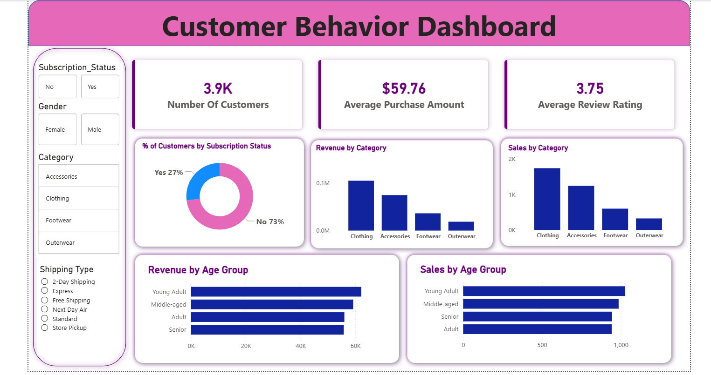

# 📊 Customer Behavior Analysis Dashboard

## 📌 Project Overview
This project simulates a corporate-grade end-to-end data analytics workflow, demonstrating the ability to transform raw data into actionable business insights.

The analysis focuses on understanding customer behavior, purchasing patterns, and key business drivers to support data-driven decision-making.

---

## 🎯 Project Objectives

- Perform data cleaning and transformation using Python  
- Analyze customer behavior and purchasing patterns using SQL  
- Build an interactive dashboard using Power BI  
- Generate business insights and recommendations  

---

## 🛠 Tools & Technologies

- Python (Pandas, Data Cleaning, EDA)  
- SQL (Data Analysis & Business Queries)  
- Power BI (Dashboard & Visualization)  

---

## 🔄 Workflow

### ✅ Data Preparation, Modeling & EDA (Python)
- Cleaned and preprocessed raw dataset  
- Handled missing values and data inconsistencies  
- Performed exploratory data analysis to understand trends  

### ✅ Data Analysis (SQL)
- Simulated business scenarios using SQL queries  
- Analyzed customer segments, purchase behavior, and loyalty patterns  
- Extracted insights for business decision-making  

### ✅ Visualization & Insights (Power BI)
- Built an interactive dashboard to visualize:
  - Customer distribution  
  - Revenue trends  
  - Sales by category and age group  
- Highlighted key performance metrics  

### ✅ Reporting & Presentation
- Summarized key findings and insights  
- Provided actionable business recommendations  

---

## 📊 Dashboard Preview

---

## 📂 Files Included

- `customer_behavior_dashboard.pbix` → Power BI Dashboard  
- `customer_behavior_sql_queries.sql` → SQL queries for analysis  
- `customer_shopping_behavior.csv` → Dataset used for analysis  
- `Customer_Shopping_Behavior_Analysis.py` → Python data analysis script  
- `Customer-Shopping-Behavior-Analysis.pptx` → Project presentation with insights and recommendations  

---

## 📈 Key Insights

- Majority of customers are non-subscribers  
- Clothing category generates the highest revenue  
- Young adults contribute significantly to overall sales  
- Average purchase amount and review ratings indicate strong customer engagement  

---

## 💡 Business Value

- Helps identify high-value customer segments  
- Supports targeted marketing strategies  
- Improves decision-making using data insights  
- Enhances understanding of customer preferences  

---

## 📊 Dataset

Sample dataset used for analysis and dashboard creation.

---

## 🚀 Conclusion

This project demonstrates the complete lifecycle of a data analytics workflow — from raw data processing to delivering business insights through visualization and reporting.
